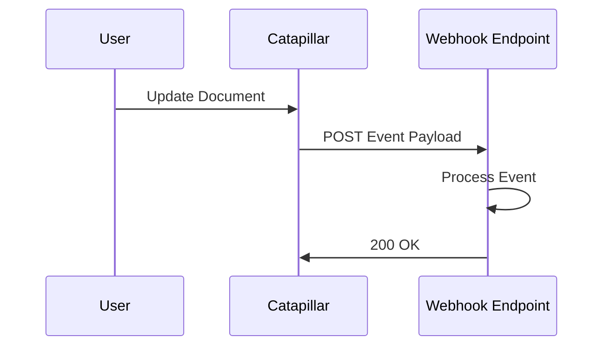

## Overview

Catapillar supports a variety of integrations to enhance your documentation workflows. Connect your Git repositories for automatic syncing, use the API for custom automation, set up webhooks for real-time updates, and link with popular third-party apps.

<Columns cols={3}>
  <Card title="Git Integration" icon="git-branch" href="#git-integration">
    Sync documentation with your version control system.
  </Card>
  <Card title="API Extensions" icon="code" href="#api-extensions">
    Build custom tools using our REST API.
  </Card>
  <Card title="Webhooks" icon="zap" href="#webhooks">
    Receive instant notifications on events.
  </Card>
</Columns>

## Git and Version Control Integrations

Connect Catapillar to GitHub, GitLab, or Bitbucket to automatically import and sync your Markdown files. This keeps your documentation in sync with your codebase.

<Steps>
  <Step title="Connect Repository" icon="git-branch">
    Navigate to the Integrations page in your Catapillar dashboard.

    Select `GitHub` (or your provider) and authorize the connection.
  </Step>
  <Step title="Select Repository" icon="package">
    Choose the repository containing your docs folder (e.g., `/docs`).

    Enable auto-sync on push events.
  </Step>
  <Step title="Import Content" icon="upload">
    Trigger the initial import. Catapillar processes Markdown files and generates pages.
  </Step>
</Steps>

<Callout kind="tip">
  Use branch protection rules in your Git provider to ensure documentation updates pass reviews before syncing.
</Callout>

## API for Custom Extensions

Build custom integrations using Catapillar's REST API at `https://api.example.com/v1`. Authenticate with your API key.

<ParamField header="Authorization" param-type="string" required="true">
  Bearer token: `Authorization: Bearer YOUR_API_KEY`
</ParamField>

<ParamField path="docs/{docId}" param-type="string" required="false">
  Document ID for specific operations.
</ParamField>

Here's how to create a new document:

<CodeGroup tabs="JavaScript,Python">
  ```javascript
  const response = await fetch('https://api.example.com/v1/docs', {
    method: 'POST',
    headers: {
      'Authorization': 'Bearer YOUR_API_KEY',
      'Content-Type': 'application/json'
    },
    body: JSON.stringify({
      title: 'New Guide',
      content: '# Hello World\nThis is automated content.'
    })
  });
  const doc = await response.json();
  console.log(doc.id);
  ```
  ```python
  import requests

  headers = {
      'Authorization': 'Bearer YOUR_API_KEY',
      'Content-Type': 'application/json'
  }
  data = {
      'title': 'New Guide',
      'content': '# Hello World\nThis is automated content.'
  }
  response = requests.post('https://api.example.com/v1/docs', headers=headers, json=data)
  doc = response.json()
  print(doc['id'])
  ```
</CodeGroup>

## Webhooks for Automation

Set up webhooks to trigger actions on events like document updates or publishes. Configure the webhook URL in your project settings.



Example payload:

<Response tabs="document.updated">
```json
{
  "event": "document.updated",
  "projectId": "proj_123",
  "docId": "doc_456",
  "timestamp": "2024-10-15T10:30:00Z",
  "changes": {
    "title": "Updated Guide",
    "updatedBy": "user_789"
  }
}
```
</Response>

Send a POST to `https://your-webhook-url.com/webhook` with the `X-Catapillar-Signature` header for verification.

## Popular Third-Party App Connections

Connect Catapillar with tools you already use.

<Tabs>
  <Tab title="Slack" icon="message-circle">
    Notify your team on document publishes.

    1. Go to Integrations > Slack.
    2. Paste your webhook URL: `https://hooks.slack.com/services/YOUR/SLACK/WEBHOOK`.
    3. Select channels for notifications.

    ```javascript
    // Slack receives:
    {
      "text": "New doc published: Updated Guide"
    }
    ```
  </Tab>
  <Tab title="GitHub Actions" icon="github">
    Automate docs in CI/CD.

    Add to your workflow YAML:

    ````yaml
    - name: Sync Docs
      uses: your-action/catapillar-sync@v1
      with:
        api-key: ${{ secrets.CATAPILLAR_API_KEY }}
        repo-path: ./docs
    ````
  </Tab>
  <Tab title="Zapier" icon="zap">
    No-code automations.

    Search for "Catapillar" in Zapier and connect triggers like "New Document".
  </Tab>
</Tabs>

<Expandable title="Advanced Integrations" default-open="false">
  For custom setups, use the full API reference. Combine webhooks with serverless functions for complex workflows.
</Expandable>

<Columns cols={2}>
  <Card title="API Reference" icon="book-open" href="/authentication">
    Full endpoint details and SDKs.
  </Card>
  <Card title="Need Help?" icon="help-circle" href="/help-center">
    Contact support for custom integrations.
  </Card>
</Columns>