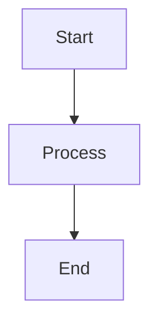

<Columns cols="4">
  <Callout kind="info" collapsed="false">
    This is an informational callout in the first column.
  </Callout>

  <Callout kind="tip" collapsed="false">
    This is a tip callout in the second column.
  </Callout>

  <Card title="Get started" href="/getting-started/introduction" icon="book-open" horizontal="false">
    Learn the core concepts and how Documentation.AI is structured.
  </Card>

  <Card title="Write docs" href="/write-and-publish/code-editor" icon="code" horizontal="false">
    Author and maintain documentation using MDX in your codebase.
  </Card>

  <Card title="Add media" href="/components/images" icon="image" horizontal="false">
    Use images and screenshots to clarify long or complex flows.
  </Card>
</Columns>

<Image src="https://your-cdn.com/hero-image.png" width="1200" height="600" alt="Hero banner showing product features" />

<Video uid="c29af0f8-395a-4d91-8320-59842544c02c" src="https://www.youtube.com/embed/dCGtPEoGNRc" render-type="iframe" width="560" height="315" controls="true" allow-full-screen="true" />

<Video src="https://www.youtube.com/watch?v=dCGtPEoGNRc&list=RDdCGtPEoGNRc&start_radio=1" render-type="video" width="672" height="378" controls="true" allow-full-screen="true" style="width: 100%; max-width: 672px; height: auto;" />

