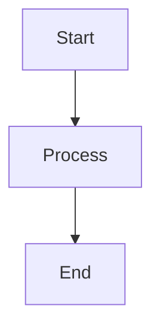

<CodeGroup show-lines={true} tabs="JavaScript,Python,Bash">
```javascript highlight="1-2" focus="3-5" wrap="true"
const API_BASE = "https://api.example.com/v2";
const API_KEY = process.env.API_KEY;

const response = await fetch(`${API_BASE}/users`, {
  headers: { "X-API-Key": API_KEY, "Content-Type": "application/json" }
});
const users = await response.json();
```
```python highlight="1,4" focus="5-8" wrap="true"
import requests
import os

API_BASE = "https://api.example.com/v2"
response = requests.get(
    f"{API_BASE}/users",
    headers={"X-API-Key": os.environ["API_KEY"], "Content-Type": "application/json"}
)
users = response.json()
```
```bash highlight="1" focus="2-4" wrap="true"
curl -X GET "https://api.example.com/v2/users" \
  -H "X-API-Key: YOUR_API_KEY" \
  -H "Content-Type: application/json" \
  | jq '.'
```
</CodeGroup>
