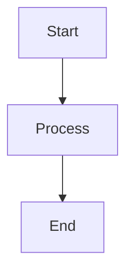
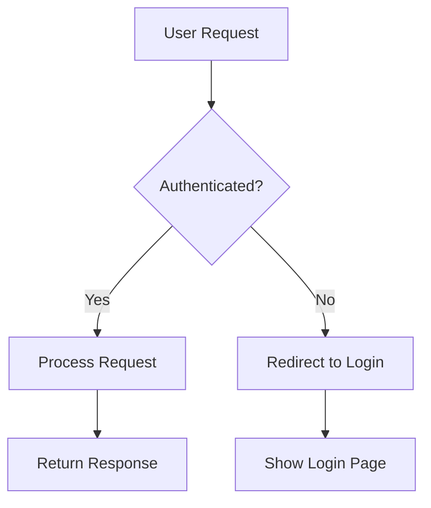

### First 
<Callout kind="info" collapsed="true">
  This is an optional deep-dive explanation that starts collapsed.
    This is an optional deep-dive explanation that starts collapsed.
  This is an optional deep-dive explanation that starts collapsed.

</Callout>


### Mermaid Diagrams 





### Images 
<Image src="https://fdjsuzcsbmpqsraaooua.supabase.co/storage/v1/object/public/documentation-images/org-53a37986-2c9e-4094-b9e8-1e1ffae9e9ee/doc-b389b141-ae58-4fd5-91f9-6702fae9ac58/1758638266765-vc81ki2xs9-abstract-image.webp" width="570" height="326" alt="Center aligned image" style="width: 570px; height: auto; cursor: pointer;" />

<Columns cols="3">
  <Card title="Get started" href="/getting-started/introduction" icon="download" horizontal="false">
    Learn the basics of your documentation project.
  </Card>

  <Card title="Write in the Web Editor" href="/write-and-publish/web-editor" icon="monitor" horizontal="false">
    Edit content visually with rich components.
  </Card>

  <Card title="Write in code" href="/write-and-publish/code-editor" icon="code" horizontal="false">
    Keep docs alongside your codebase using MDX.
  </Card>
</Columns>

<Update label="2024-10-20" description="v2.0.0" tags={["breaking","security","performance"]}>
  ### Example: Major release

  This release includes breaking changes and performance improvements.

  - Updated API authentication flow requiring new credentials

  - Optimized database queries for 3x faster response times

  - Enhanced security with improved encryption standards
</Update>

```python
a=10 
print("tha value of a is: ",a)
for i in range(10):
  print(i)
```

<Steps>
  <Step title="Name" icon="download" title-type="p">
    This is about javeed name

    ```bash
    npm install documentation-ai
    ```
  </Step>

  <Step title="age" icon="settings" title-type="p">
    This is about the age of the javeed

    ```bash
    npm install javeed-age
    ```
  </Step>
</Steps>

<Update label="2024-10-15" description="v1.2.0">
  Released new analytics dashboard with real-time metrics and custom reporting.
</Update>

